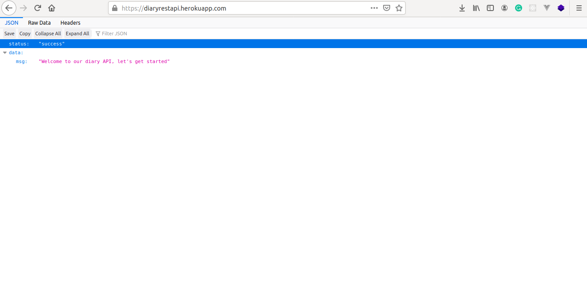

### A Flask REST API guide
##### Building a note writing REST API (a diary app)

This is currently hosted on heroku, click [here](https://diaryrestapi.herokuapp.com/)

The tutorial is structured into the following

> - [Structuring a Flask Restful project for production.](https://oluchiorji.com/structuring-a-flask-restful-api-for-production/)
>  - [Creating Custom Error Pages and Handling Exceptions for Flask](https://oluchiorji.com/creating-custom-error-pages-and-handling-exceptions-for-flask/)
> - [ Flask App Authentication with JWT ](https://oluchiorji.com/flask-app-authentication-with-jwt/)
> - [CRUD operations(GET, POST, UPDATE, and DELETE) with Flask.](https://oluchiorji.com/crud-operations-using-flask/)
> - [Object serialization with Marshmallow](https://oluchiorji.com/object-serialization-with-marshmallow/)
> - [Email setup and confirmation](https://oluchiorji.com/email-set-up-and-confirmation/)
> -  [Working with file upload](https://oluchiorji.com/handling-file-upload/)
> - [Flask: Setting Up Tests and Logging.](https://oluchiorji.com/flask-setting-up-tests-and-logging/) 
> - Set Up CI/CD with Github Actions for Flask  ( **tutorial coming soon**)
> - Deploying our app on Heroku ( **tutorial coming soon**)

### To set up the app locally on your system, do the following
##### Set up your virtual environment and install app dependencies
- `python 3 -m venv env `
- `source env/bin/activate `
- `pip install -r requirements.txt`

### Add environment variables, copy the following below and add to .env file
- `FLASK_APP=main.py` 
- `FLASK_DEBUG=1 `
- `FLASK_ENV=development`
- `MAIL_PORT=587`
- `MAIL_USE_TLS = True`
- `DEV_DATABASE_URL=''`
- `TEST_DATABASE_URL=''`
- `SECRET_KEY=''`
- `MAIL_SERVER = ''`  
- `MAIL_USERNAME = ''`   
- `MAIL_PASSWORD = ''`
- `SENDGRID_API_KEY = ''`
- `SECURITY_PASSWORD_SALT=''`
- `MAIL_DEFAULT_SENDER=''`

##### Upgrade database and run your flask app
- `flask db upgrade`
- `flask run`

##### Run tests locally
`flask test` or `python -m unittest`